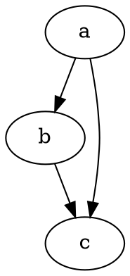

```jsx{5}
class ShoppingList extends React.Component {
  render() {
    return (
      <div className="shopping-list">
        <h1>Shopping List for {this.props.name}</h1>
        <ul>
          <li>Instagram</li>
          <li>WhatsApp</li>
          <li>Oculus</li>
        </ul>
      </div>
    );
  }
}
```

```java{1,4-6}
class Solution {
    public List<Integer> getRow(int rowIndex) {
        List<Integer> ans = new ArrayList<>(); 
        if (rowIndex == 0) {
            ans.add(1);
            return ans;
        }
        List<Integer> lastRow = getRow(rowIndex - 1);
        for (int i = 0; i <= rowIndex; i++) {
            if (i == 0 || i == rowIndex) {
                ans.add(1);
            } else {
                ans.add(lastRow.get(i - 1) + lastRow.get(i));
            }
        }
        return ans;
    }
}
```

```python{1,4-6}
class Solution:
    def alphabetBoardPath(self, target: str) -> str:
        ans = ""
        target = 'a' + target
        for i in range(1, len(target)):
            first = target[i - 1]
            second = target[i]
            ans += move(first, second)
        return ans
            
            
def move(start, end):
    start_y, start_x = get_pos(start)
    end_y, end_x = get_pos(end)
    diff_y = start_y - end_y
    diff_x = start_x - end_x
    diff_y_str = ('D' if diff_y < 0 else 'U') * abs(diff_y)
    diff_x_str = ('R' if diff_x < 0 else 'L') * abs(diff_x)
    # 'z' is special, can't move out of board.
    return ((diff_x_str + diff_y_str) if diff_y < 0 else (diff_y_str + diff_x_str)) + '!'
        
def get_pos(c):
    num = ord(c) - ord('a')
    # board = ["abcde", "fghij", "klmno", "pqrst", "uvwxy", "z"]
    # there are 5 characters each row
    return num // 5, num % 5
```

```css
.grid {
  display: grid;
  grid-gap: 30px;
  grid-template-columns: repeat(auto-fill, 112px);
  /* or this */
  grid-template-columns: repeat(auto-fill, minmax(112px, 1fr));
}

/* To select modern Grid browsers and IE 11 */
@supports (display: grid) {
  grid-gap: 20px;
}
```

```css
@font-face {
  font-family: 'MyWebFont';
  src: url('myfont.woff2') format('woff2'), url('myfont.woff') format('woff');
  font-display: 'swap';
}

```
# h1 Heading 👀
## h2 Heading
### h3 Heading
#### h4 Heading
##### h5 Heading
###### h6 Heading

## Code
```python
def func(param):
    print('hello world!')
```

## Horizontal Rules

___

---

***

## Emphasis

**This is bold text**

__This is bold text__

*This is italic text*

_This is italic text_

~~Strikethrough~~


## Blockquotes


> Blockquotes can also be nested...
>> ...by using additional greater-than signs right next to each other...
> > > ...or with spaces between arrows.


## Lists

Unordered

+ Create a list by starting a line with `+`, `-`, or `*`
+ Sub-lists are made by indenting 2 spaces:
  - Marker character change forces new list start:
    * Ac tristique libero volutpat at
    + Facilisis in pretium nisl aliquet
    - Nulla volutpat aliquam velit
+ Very easy!

Ordered

1. Lorem ipsum dolor sit amet
2. Consectetur adipiscing elit
3. Integer molestie lorem at massa


1. You can use sequential numbers...
1. ...or keep all the numbers as `1.`

Start numbering with offset:

57. foo
1. bar


## Code

Inline `code`

Indented code

    // Some comments
    line 1 of code
    line 2 of code
    line 3 of code


Block code "fences"

```
Sample text here...
```

Syntax highlighting

``` js
var foo = function (bar) {
  return bar++;
};

console.log(foo(5));
```

```diff
function addTwoNumbers (num1, num2) {
-  return 1 + 2
+  return num1 + num2
}
```

## Tables

| Option | Description |
| ------ | ----------- |
| data   | path to data files to supply the data that will be passed into templates. |
| engine | engine to be used for processing templates. Handlebars is the default. |
| ext    | extension to be used for dest files. |

Right aligned columns

| Option | Description |
| ------:| -----------:|
| data   | path to data files to supply the data that will be passed into templates. |
| engine | engine to be used for processing templates. Handlebars is the default. |
| ext    | extension to be used for dest files. |


## Links

[link text](http://dev.nodeca.com)

[link with title](http://nodeca.github.io/pica/demo/ "title text!")

Autoconverted link https://github.com/nodeca/pica (enable linkify to see)


## Images


Like links, Images also have a footnote style syntax

![Alt text][id]

With a reference later in the document defining the URL location:

[id]: https://octodex.github.com/images/dojocat.jpg  "The Dojocat"

## Math
$a^2 + b^2 = c^2$

$$
a^2 + b^2 = c^2
$$

## graphviz

